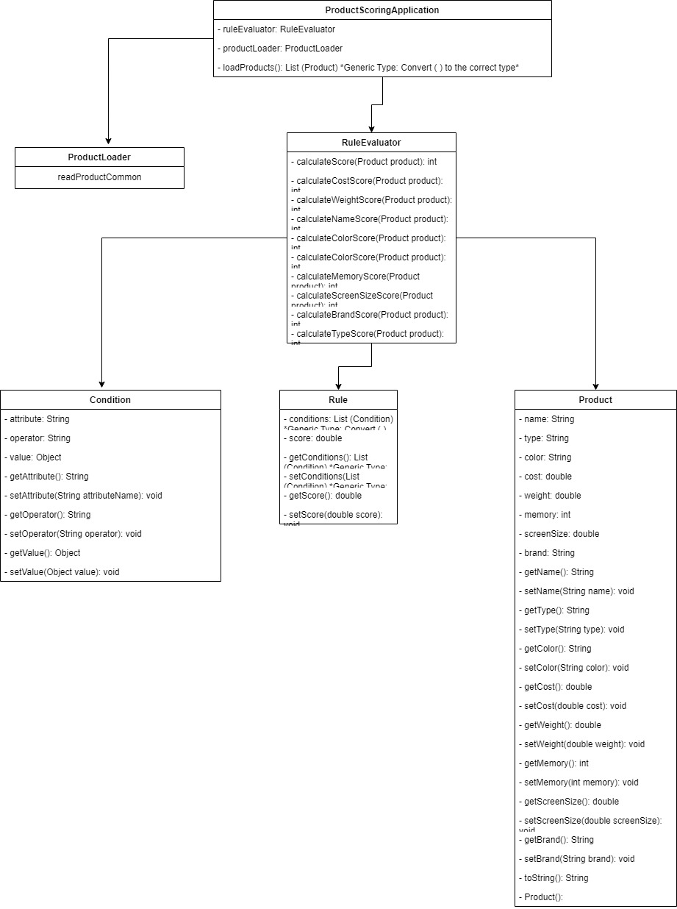

# productScoreCalculator
This repo is for calculating the product score
## Usage

This repo is for calculating the product score
## Usage
UML Diagram


To calculate the product score, follow these steps:

1. Clone the repository:

    ```bash
    git clone https://github.com/your-username/productScoreCalculator.git
    ```

2. Navigate to the project directory:

    ```bash
    cd productScoreCalculator
    ```

3. 

To calculate the product score, follow these steps:

1. Clone the repository:

    ```bash
    git clone https://github.com/your-username/productScoreCalculator.git
    ```

2. Navigate to the project directory:

    ```bash
    cd productScoreCalculator
    ```

3. 
